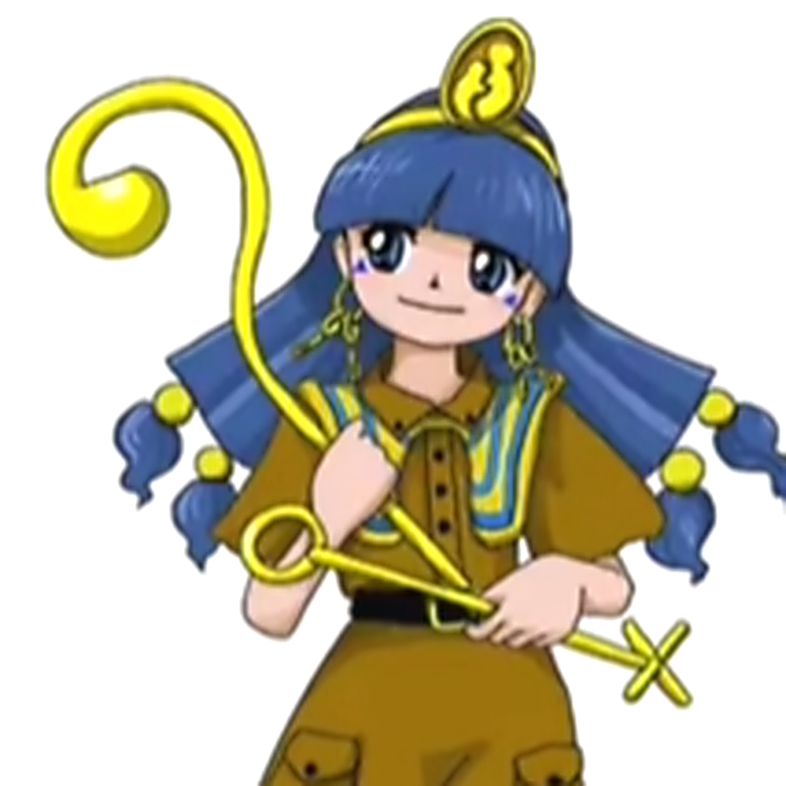

# TH20 iOS Port

<p align="center">
  
</p>

An iOS 14+ native port of *Touhou Kinjoukyou: Fossilized Wonders*. The project combines recovered C++ game logic with UIKit and OpenGL ES platform code and does not depend on a browser runtime.

This project was developed with **Vibe Coding**: iterative, tool-assisted implementation guided by real-device diagnostics, focused tests, and review of the resulting source.

## Source and contributions

The native iOS work is maintained in this repository. The recovered game logic, resource tooling, and web-port foundations are based on the open-source work in [Oracatt/touhou20-web](https://github.com/Oracatt/touhou20-web), with iOS-specific integration and input, rendering, settings, portrait layout, icon, and packaging work added here.

The repository also follows implementation ideas from [th07-ios-port](https://github.com/Ymgjdsh/th07-ios-port), especially its mobile build organization and touch-control presentation.

## Contents

- `source_reconstruction/`: recovered game-logic modules.
- `native_recovered/`: verified native recovery code.
- `src/` and `include/`: resource, script, and runtime parsing code.
- `ios/`: iOS host, input, rendering, audio, settings, tests, and build configuration.
- `tests/`: source and platform validation.
- `tools/`: build, resource verification, and packaging helpers.

The repository does not include original game data, the original executable, or an IPA. Building requires game data that you legally own and a local asset path supplied to the build script.

## Building for iOS

Requirements: macOS, Xcode 14 or newer, CMake, and the iOS 14 SDK. Put `th20.dat` and `thbgm.dat` in an external asset directory and run:

```sh
TH20_CONFIGURATION=Release \
TH20_SDK=iphoneos \
TH20_TARGET=th20_ios_game \
TH20_ASSET_DIR=/path/to/owned/game-assets \
bash ios/build_ios.sh
```

The device build is written to `build-native-iphoneos/Release-iphoneos/th20_ios_game.app`. Use `ios/tools/package_ipa.py` to validate architecture, resources, signing, and archive integrity before installing it on a test device. The default output is ARM64 for iOS 14+ and is unsigned; installation requires a signing method accepted by the device, such as TrollStore or development signing.

## Touch controls

Settings provide `Hybrid`, `Drag`, and `Joystick` movement modes, a `No Button` option, freely movable controls, left-handed layout, frame-rate selection, and render-quality settings.

- `Z`: shoot / confirm
- `S`: focus movement
- `X`: bomb / back
- Two-finger tap during gameplay: bomb
- Three-finger long press during gameplay: pause
- Two-finger tap in menus: back

## Assets and copyright

This repository publishes porting code and build tools only. Game data, character artwork, music, and other original content remain the property of their respective rights holders. Use only assets you have legally obtained and follow applicable law and the original game's licensing terms.

## Credits

- [Oracatt/touhou20-web](https://github.com/Oracatt/touhou20-web), for the open-source TH20 recovery, game logic, resource tooling, and web-port foundation contributed to this project.
- [th07-ios-port](https://github.com/Ymgjdsh/th07-ios-port), for reference mobile build and touch-control patterns.
- Team Shanghai Alice, for the original game.

---

# TH20 iOS 移植版

<p align="center">
  
</p>

这是面向 iOS 14 及以上设备的《东方锦上京》原生移植工程。项目将恢复的 C++ 游戏逻辑与 UIKit、OpenGL ES 平台适配层结合，不依赖浏览器运行时。

本项目采用 **Vibe Coding** 工作方式，通过工具辅助迭代开发，结合真机诊断、针对性测试和源码审查持续完善实现。

## 源码来源与贡献

本仓库维护 iOS 原生移植部分。恢复后的游戏逻辑、资源工具和网页移植基础来自 [Oracatt/touhou20-web](https://github.com/Oracatt/touhou20-web) 的开源工作；本仓库在此基础上增加了 iOS 集成、触摸输入、渲染、设置、竖屏布局、图标和 IPA 打包等内容。

移动端构建组织和触摸控制呈现方式也参考了 [th07-ios-port](https://github.com/Ymgjdsh/th07-ios-port) 的实现思路。

## 内容结构

- `source_reconstruction/`：恢复的游戏逻辑模块。
- `native_recovered/`：经过校验的原生恢复代码。
- `src/`、`include/`：资源、脚本和运行时解析代码。
- `ios/`：iOS 主机、输入、渲染、音频、设置、测试和构建配置。
- `tests/`：源码和平台行为验证。
- `tools/`：构建、资源校验和打包工具。

仓库不包含原版游戏数据、原版可执行文件或 IPA。构建需要用户合法拥有的游戏资源，并通过本地资源目录传给构建脚本。

## iOS 构建

环境要求：macOS、Xcode 14 或更新版本、CMake，以及 iOS 14 SDK。将 `th20.dat` 和 `thbgm.dat` 放在工程外部的资源目录中，然后运行：

```sh
TH20_CONFIGURATION=Release \
TH20_SDK=iphoneos \
TH20_TARGET=th20_ios_game \
TH20_ASSET_DIR=/path/to/owned/game-assets \
bash ios/build_ios.sh
```

设备构建输出位于 `build-native-iphoneos/Release-iphoneos/th20_ios_game.app`。可使用 `ios/tools/package_ipa.py` 检查架构、资源、签名和 ZIP 完整性。默认输出为 ARM64、iOS 14+ 未签名包，安装需要设备接受的签名方式，例如 TrollStore 或开发者签名。

## 触摸操作

设置支持 `Hybrid`、`Drag` 和 `Joystick` 三种移动方式，也支持 `No Button`、自由调整按键与摇杆位置、左手布局、帧率和画面清晰度设置。

- `Z`：射击 / 确认
- `S`：低速移动
- `X`：符卡 / 返回
- 战斗中双指轻按：释放符卡
- 战斗中三指长按：暂停
- 菜单中双指轻按：返回

## 资源与版权

本仓库只发布移植代码和构建工具。游戏数据、角色图像、音乐及其他原作内容的版权归各自权利人所有。请只使用合法取得的资源，并遵守当地法律和原作许可要求。

## 致谢

- [Oracatt/touhou20-web](https://github.com/Oracatt/touhou20-web)：提供 TH20 恢复工程、游戏逻辑、资源工具和网页移植基础。
- [th07-ios-port](https://github.com/Ymgjdsh/th07-ios-port)：提供移动端构建和触摸控制方面的参考。
- Team Shanghai Alice：原作游戏的创作者。
