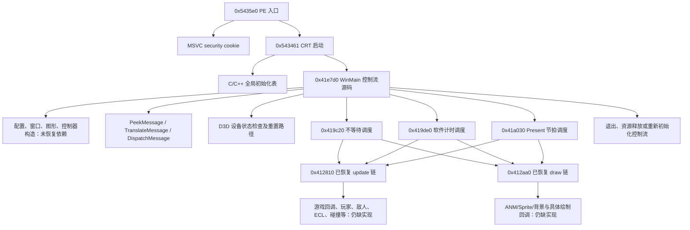

# 程序入口与帧调度的真实 C++ 模块

本目录提供手工恢复的 WinMain 控制流、三个帧调度器及有关字段操作，已编译为 Win32 静态库。它不启动原 EXE、不把机器码编入数组、不解释原指令，也不以空函数或虚假返回值填补游戏实现。**编译通过只证明这些源码能形成模块，尚未证明原 CPU、画面、COM、时钟或完整游戏行为等价。**

`unrecovered_dependencies.hpp` 的缺失函数只有声明，没有实现。`program_entry.hpp` 的全局存储和初始化也只声明了接口。当前编译产物实际存在 **50 个未恢复函数符号、13 个未定义全局存储/环境符号**；`module_status.json` 保存逐项符号、源码哈希和库哈希。还有两个跨模块调用已经连接至本工程真实恢复的 `core_scheduler::dispatch_update/dispatch_draw`，并非缺失实现；但该模块验证不能扩展为本目录整体通过原 CPU 验证。

## 文件及恢复范围

| 文件 | 内容 | 当前证据 |
|---|---|---|
| `program_entry.cpp` | `0x0041e7d0` 的初始化、消息循环、设备重置、退出及重新初始化路径 | 人工核对原汇编；可编译；未做该函数原 CPU 差分 |
| `frame_schedulers.cpp` | `0x00419c20`、`0x00419de0`、`0x0041a030`，9 个字段/COM 操作 | 原指令顺序、常量和分支核对；可编译；未做整个调度器差分 |
| `winmain.cpp` | 正常 C++ Windows 程序入口，调用上面的源码函数 | 等完整依赖恢复后由 MSVC CRT 链接；没有原程序启动器 |
| `program_entry.hpp` | 窗口及图形对象的已识别前缀布局 | 32 位 `offsetof`/`sizeof` 静态断言通过；未知范围保留为未知字段 |
| `unrecovered_dependencies.hpp` | 尚未恢复的真实调用接口 | 地址来自原调用点；不提供实现 |
| `text_constants.hpp` | 5 个 CP932 原文字符串 | 从指定哈希 EXE 提取的数据；构建时无需原 EXE |
| `entry_call_graph.json` | 22 个选定函数、194 条已解析调用边及 CRT 初始化函数表 | 直接来自现有完整反汇编和 Ghidra 函数区间 |
| `evidence/*.asm` | 上述函数的原汇编证据 | 只供阅读，不是任何编译目标输入 |
| `module_status.json` | 静态库符号审计 | 编译检查，不是游戏等价报告 |

9 个小操作对应原地址：`0x0041cc70`、`0x0041d080`、`0x0041dcc0`、`0x0041de00`、`0x0041de30`、`0x00412730`、`0x00415800`、`0x0041a240`、`0x0041a200`。`0x0041b480` 的置前台调用和 `0x0041b490` 的系统设置恢复也作为 WinMain 的源码逻辑实现。

## 已校正的反编译错误

- 真正入口为 `0x005435e0`，调用安全 cookie 初始化后尾跳至 `0x00543461`。后者是 MSVC CRT 启动，不能当作游戏主循环。
- `0x0054354f..0x00543557` 明确压入四个 WinMain 参数；`0x0041f1b6` 是 `ret 0x10`。因此 `0x0041e7d0` 是四参数 `int WINAPI WinMain`，并非 Ghidra 给出的单参数 `void`。
- 最终 `return 0` 有 `0x0041f18d` 写零和 `0x0041f1a2` 装入 EAX 的原指令依据，不是为了链接添加的占位返回值。
- 图形对象 `0x005c4d40 + 0xe4` 对应 `D3DPRESENT_PARAMETERS`。`+0x104` 是 Windowed，`+0x118` 是 PresentationInterval。
- Direct3D 设备虚表偏移 `+0x0c/+0xa4/+0xa8/+0x104` 分别对应 TestCooperativeLevel、BeginScene、EndScene、SetTexture。Ghidra 将两个 Release 方法误标为 MFC `CDocObjectServer::ReleaseDocSite`，本目录按实际对象字段与 COM 调用恢复。
- `0x005c4f84` 的 frame_skip 由 MOVZX 读取，是无符号字节；窗口 `+0x70` 的绘制计数由 MOVSX 读取，是有符号字节。不能统一改成普通 int 而忽略字节回绕。
- 原 `0x0040c6b0` 确实只有五字节空过程，即使调用处传入 `%d, %d`，也没有输出；`0x004111e0` 返回 -1，`0x00412540` 返回 0，二者无外部副作用且结果未使用。源码省略这三个已证实无效果调用，未给未知函数添加空实现。
- 调度器常量来自原数据：`1.0 / 60.0`、提前 `1.5` 毫秒时 Sleep(1)、秒与毫秒换算 `1000.0`。使用 SSE2 二元运算保留计算顺序；尚未完成其浮点控制环境、计时与整帧行为的硬件对照。

## 根调用图与独立链接障碍



当前独立链接首先缺少窗口/配置初始化、图形设备创建及恢复、Sprite 控制器、日志/分配对象、锁注册表与准确时钟。`0x004de1f0` 的游戏初始化尚未恢复，因而没有真实游戏回调注册到已经恢复的函数链。玩家、敌机、ECL/ANM、碰撞、道具、音乐、菜单及回放继续是后续任务。还需要确认 CRT 初始化表内每个游戏全局构造器，不能直接定义全零全局对象冒充初始化完成。

`FunctionController` 已按 `core_scheduler::State` 的真实 56 字节布局建立类型别名；三个帧调度器直接调用该源码库。`scheduler_environment` 仍只声明，须与原锁注册表以及分配生命周期一起集成，不得随意创建另一组锁后宣称线程语义一致。

根图只有静态可解析边。接口虚表、回调与线程入口中的间接调用仍需追踪；194 条边不能表示整款游戏只有这些函数。

## 重复构建和符号审计

在项目根目录执行：

```powershell
cmake -S source_reconstruction/program_entry -B source_reconstruction/program_entry/build -G 'Visual Studio 16 2019' -A Win32 -DTH20_BUILD_ORACLE=OFF
cmake --build source_reconstruction/program_entry/build --config Release --parallel
python source_reconstruction/program_entry/audit_module.py source_reconstruction/program_entry/build/Release/th20_program_entry_source.lib --dumpbin 'D:\VS2019\IDE\VC\Tools\MSVC\14.29.30133\bin\Hostx64\x86\dumpbin.exe'
```

构建不读取原 EXE。仅在需要重新核对文字和汇编证据时执行 `extract_evidence.py 原版EXE路径`；它先核对 SHA-256，再读取常量、函数区间和调用记录，全部输出在本目录。
